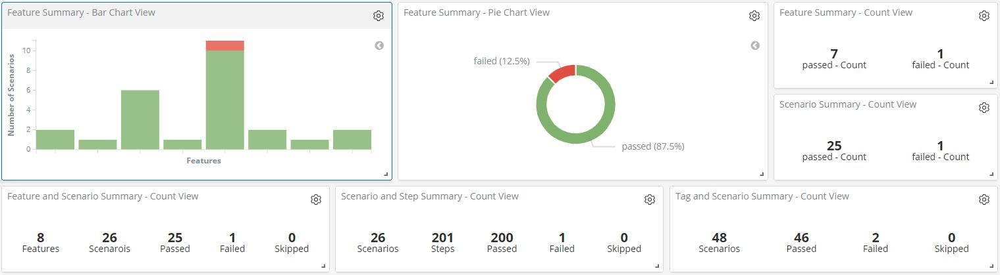
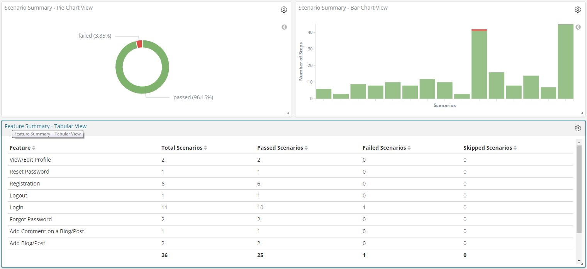
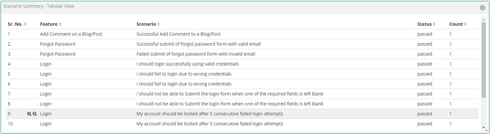
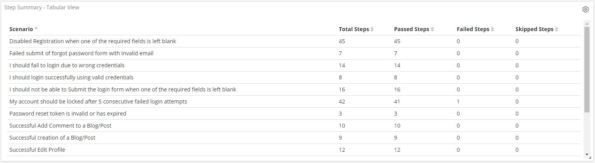
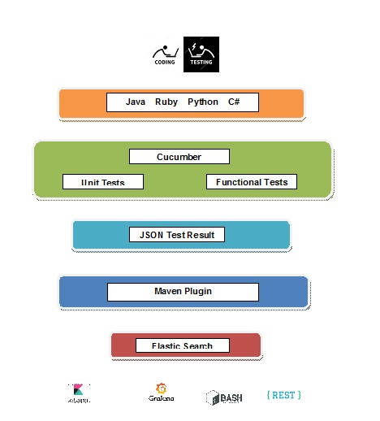

# Real-time reporting of cucumber tests to Elastic Search

## Elastic Search and Kibana for Cucumber Reports
						 
### Journey and Idea
Very recently, I started learning and doing hands-on on Cucumber in Java and wrote my first Cucumber+TestNG+Selenium Automation Test Framework. I used a couple of third party reporting plugins to generate detailed HTML reports website containing single and/or many web pages. Though I liked the reports and found them useful, yet I needed a better and unified overview of the results which is UI agnostic.

With the clear requirement in mind, I did some research on internet and talk with colleagues around me. I came across the ELK (Elasticserach, Logstash, Kibana) solution but all 3 were quite new to me, though I installed all three on my machine and started exploring them. Very soon, I figured out that it would be quite a challenge and time consuming to learn and perform the desired result with Logstash and its various plugins.

Being a Java developer at heart and learning the fact that the 2 of the reporting plugins I used and mentioned above, are using the JSON test result file(s) as input and writing the HTML files as output, I decided to go for the solution same way but change the output destination (Elastic Search not HTML pages).

With test report data in Elastic Search, I can have a unified dashboard on UI agnostic tools like Kibana/Grafana for all tests with the possibility to filter and analyze the data, extend and share it across teams.

### Pros
1. **Java/Maven solution** - Java has been among top 3 prefrred languages in the world for BDD implementation. Hence the solution can easily be plugged in with the system.
2. **Plug and Play** - With cucumber test result data in Elastic Search, the user can easily plugin any tool/script (Kibana, Grafana, Shell, REST) and play around the test result data.
3. **UI agnostic**  - No static HTML web page(s), hence the control of creation and management of Dashboard fully lies into the hands of the end user using a tool like Kibana. The end users can select what they want to/not to see on their dashboard.
3. **Continuous Integration** - Can easily be integrated with Jenkins. 
4. **Power of Elastic Search** - Enables the plugin as well as end user to get all the benefits of Elastic Search. 
5. **Power of Kibana** - Enables the end user to apply filter and analyze the data, extend and share it across teams.
6. **Handy Configurable options** - The plugin user has set of configuration options available to control things like,
   - skip reading the Cucumber Test Report(JSON file(s)) and ask the plugin to exit(defaults to false).
   - change/overwrite the Hostname of Elastic Search Server (defaults to localhost).
   - change/overwrite sending the Feature, Scenario, Step, Tag specific JSON documents to Elastic Search(defaults to false).
   - change/overwrite the 'index' and 'document_type' for Feature, Scenario, Step, Tag specific documents for Elastic Search.

### Cons
1.	Details of failures like assertion failures/stacktrace (screenshots in case of selenium) not available. 

### Kibana Dashboard

### Achitecture

### Roadmap

1.	Give a nice name to the plugin. Ask the colleagues for suggestions. I named it Cucelastic plugin.
2.	Give an icon to the plugin. I made an icon but need some editing.
4.	Publish the plugin on Maven Cenral.
5.	Write Blogs to let the world know and use it.
6.	Discuss and take feedback for future improvement and enhancement.
